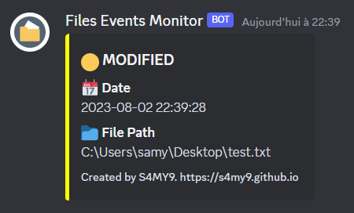

# Files Events Monitor: A Tool for Monitoring File System Activity



## Overview

**Files Events Monitor** is a Python-based command-line tool that uses the `watchdog` library to monitor a specified directory for any file system events. It supports the following events:

- **Created**: When a new file or directory is created.
- **Deleted**: When a file or directory is deleted.
- **Modified**: When the content of a file is modified.
- **Moved**: When a file or directory is moved or renamed.

With **Files Events Monitor** you can receive instant notifications for changes or suspicious activities in your monitored directory. It logs events and allows you to save them to a file for further analysis. Additionally, it supports integration with Discord webhooks, delivering event notifications directly to your Discord server or channel, enhancing real-time monitoring and collaboration for you and your team.

## Requirements

   ```
   pip install watchdog requests
   ```

## Usage

The tool can be executed from the command line with the following syntax:

```
python files_events_monitor.py <directory> [-h] [-w] [-o]
```

- `<directory>`: The path of the directory you want to monitor.

Optional Arguments:

- `-w`, `--webhook`: Discord webhook URL to receive alerts.
- `-o`, `--output`: Path to the output file where event logs will be saved.

## License

This project is released under the [MIT License](LICENSE).

Disclaimer: This tool is provided for educational and security awareness purposes only. The author and contributors are not responsible for any misuse or damage caused by the tool. Always use it responsibly and with proper authorization.